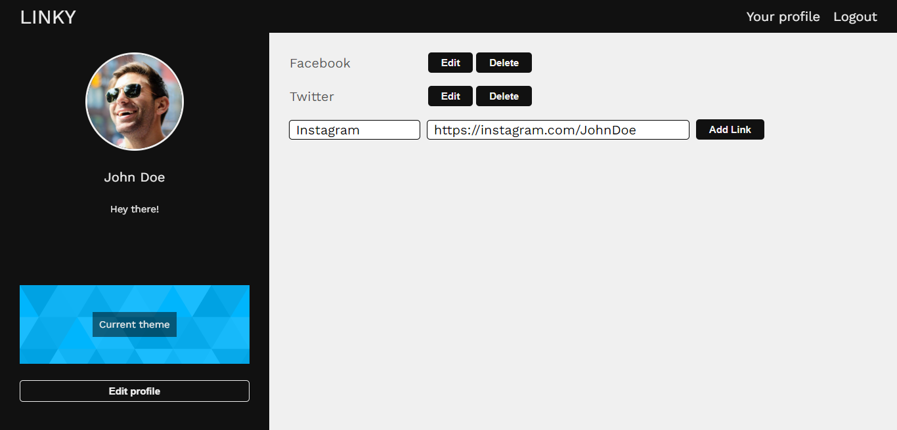
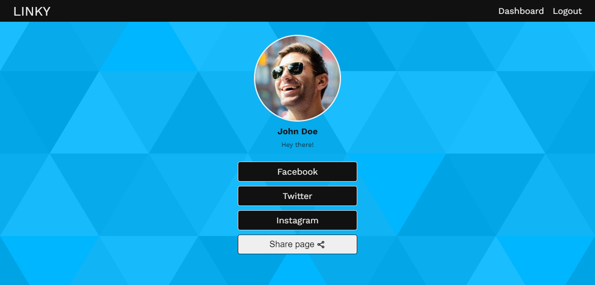

# LINKY

**This repo corresponds to the frontend of the application.**

App in the style of BEACONS, LINKTR, etc. Provides an easy interface to add links, edit and share your profile.

1. Node.js
2. React.js
3. MongoDB
3. JWT Auth

[Live Demo](https://www.mern-linky.herokuapp.com)

